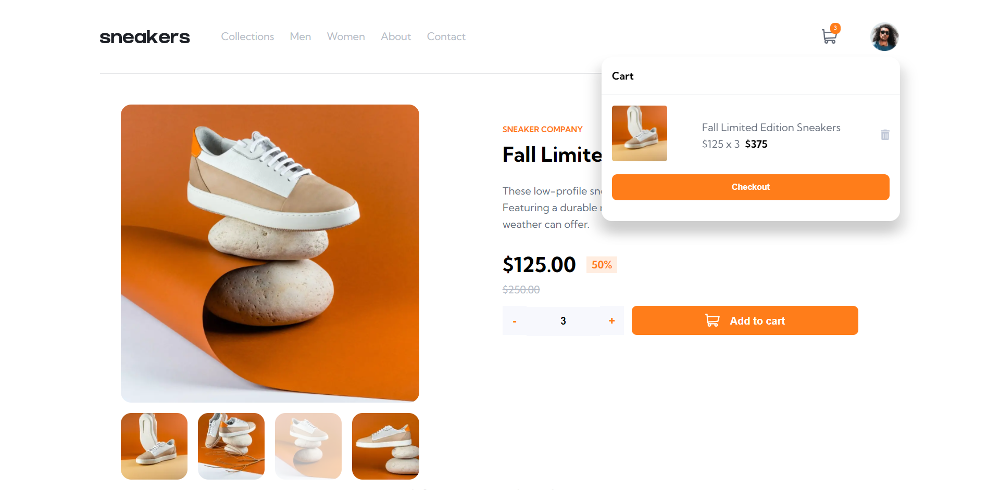
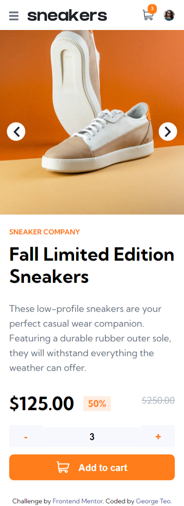

# Frontend Mentor - Sunnyside agency landing page solution

This is a solution to the [Sunnyside agency landing page challenge on Frontend Mentor](https://www.frontendmentor.io/challenges/sunnyside-agency-landing-page-7yVs3B6ef). Frontend Mentor challenges help you improve your coding skills by building realistic projects.

## Table of contents

- [Overview](#overview)
  - [The challenge](#the-challenge)
  - [Screenshot](#screenshot)
  - [Links](#links)
- [My process](#my-process)
  - [Built with](#built-with)
  - [What I learned](#what-i-learned)
  - [Continued development](#continued-development)
  - [Useful resources](#useful-resources)
- [Author](#author)

## Overview

### The challenge

Users should be able to:

- View the optimal layout for the site depending on their device's screen size
- See hover states for all interactive elements on the page
- Open a lightbox gallery by clicking on the large product image
- Switch the large product image by clicking on the small thumbnail images
- Add items to the cart
- View the cart and remove items from it

### Screenshot

Desktop Site            |  Mobile Site
:-------------------------:|:-------------------------:
 |  


### Links

- Solution URL: [Github Repo](https://github.com/Georgetxm/frontend-mentor-ecommerce-page)
- Live Site URL: [Vercel App](https://sunnyside-agency-i3d12cbca-georgetxm.vercel.app/)

## My process

### Built with

- Next.js
- Redux
- CSS custom properties
- Flexbox
- Mobile-first workflow


### What I learned

Everything about Nextjs, the server-side-rendering, project structure, styling best practices.

```css
.about { 
  display: grid;
  grid-template-areas:
    "transform-image",
    "..."
}

.about__items:nth-child(1) {
  grid-area: transform-image;
}
...
.about__items:nth-child(6) {
  grid-area: photography;
}

```

Creating a Modal for the Mobile Navigation from scratch in React by combining CSS, a custom hook and React's useEffect to read the screen sizes.

``` javascript
const useMediaQuery = (width) => {
  const [targetReached, setTargetReached] = useState(false);

  const updateTarget = useCallback((e) => {
    if (e.matches) {
      setTargetReached(true);
    } else {
      setTargetReached(false);
    }
  }, []);

  useEffect(() => {
    const media = window.matchMedia(`(min-width: ${width}px)`);
    media.addEventListener("change", updateTarget);

    if (media.matches) {
      setTargetReached(true);
    }

    return () => media.removeEventListener("change", updateTarget);
  }, []);

  return targetReached;
};

// Omitted //
const Nav = () => {
  // ... //
  useEffect(() => {
    if (!isBreakPoint) {
      const modal = document.getElementById("nav-modal");
      if (showMobileNav) {
        modal.style.display = "block";
      } else {
        modal.style.display = "none";
      }
    }
  }, [showMobileNav]);

  useEffect(() => {
    if (!isBreakPoint) {
      const modal = document.getElementById("nav-modal");
      window.addEventListener("click", (e) => {
        if (e.target == modal) {
          modal.style.display = "none";
          setShowMobileNav(!setShowMobileNav);
        }
      });
    }
  }, []);
  // ... //
}
```

```css
.primary-navigation-mobile {
    display: none;
    position: fixed;
    transform: none;
    transition: transform 350ms ease-in-out;
    background-color: rgba(0, 0, 0, 0.7);
    width: 100vw;
    height: 100vh;
    z-index: 999;
    top: 0;
    left: 0;
}

```

Creating a Slideshow Gallery, Lightbox and Image Grid on React using the useState and useEffect hooks.

```javascript
 const [slideNumber, setSlideNumber] = useState(1);
  const [showImageModal, setShowImageModal] = useState(false);
  const [clickedSlide, setClickedSlide] = useState(null);

  let slides = document.getElementsByClassName(
    `${styles["slideshow-image-div"]}`
  );
  let thumbnails = document.getElementsByClassName(
    `${styles["slideshow-thumbnail-div"]}`
  );

  useEffect(() => {
    for (let i = 0; i < slides.length; i++) {
      slides[i].style.display = "none";
      thumbnails[i].style.opacity = null;
    }
    slides[slideNumber - 1].style.display = "block";
    thumbnails[slideNumber - 1].style.opacity = "0.3";
  }, [slideNumber]);

  const showModal = (clickedSlide) => {
    setClickedSlide(clickedSlide);
  };

  useEffect(() => {
    if (clickedSlide != null) {
      setShowImageModal(!showImageModal);
    }
  }, [clickedSlide]);
```

### Continued development

Moving forward, specific to this project, I'll want to create a mock server and fill it with dummy products to simulate an end-to-end ecommerce application. On the frontend, a catalog page will be created to display the dummy products.

In general, as I am comfortable with designing responsive webpages now, I'll want more practice on Nextjs & Redux stack. I want to focus on development with data from a backend server and utilising Redux to manage the state. That said, a deeper dive on CSS Grids & Flexbox will also be on my development roadmap.

### Useful resources

- [Next.js Crash Course - Traversy Media](https://www.youtube.com/watch?v=mTz0GXj8NN0&t=479s) - Exactly as stated in the title, this video provides you the essential knowledge on Next.js in a succinct and easy to understand manner.
- [Next.js Documentation](https://nextjs.org/docs) - For a deeper dive into the specificalities of Next.js.
- [Redux Essentials](https://redux.js.org/tutorials/essentials/part-1-overview-concepts) - Having been out of touch with React & Redux for 2 years, I went over the practice within this documentation to gain an understanding of how to utilise the "new" Redux Toolkit.
- [W3Schools Slideshow Gallery](https://www.w3schools.com/howto/howto_js_slideshow_gallery.asp) - The fundamentals of how to create a slideshow gallery with vanilla javascript and CSS. I refered to it and customised it to my project with React.

## Author

- LinkedIn - [George Teo Xuan Ming](https://www.linkedin.com/in/georgetxm/?originalSubdomain=sg)
- Frontend Mentor - [@Georgetxm](https://www.frontendmentor.io/profile/Georgetxm)
